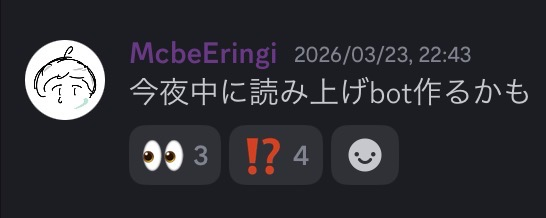

# 3日で作るDiscord読み上げBOT


22 McbeEringi
date: 260329

---

# なぜ?

- 既存サービスで満足できない
    - 遅延
    - 不可解な挙動

- Discordのbotを作ったことがない
    - 入門に丁度良いテーマ
    - 読み上げbotくらい自分で作りたくないですか?作りたいですよね?作りたいんですよ

---

# VOICEVOX
- ずんだもんで広く知られる音声合成エンジン
- エディタ+エンジン+コア の三段構成
    - エディタ: UI
    - エンジン: API
    - コア: 音声データとアルゴリズム

discordからエンジンを操作する

---

# Discord.js
- DiscordのBOTを簡単に作れるライブラリ
    - PythonのDiscord.pyと共に広く使われている
    - McbeEringiはJS使い
- つかいかた
    - Discordからトークンを取得
    - Discordで権限設定
    - のりでコード書く
    - (宅|Discord)鯖に入れる

かんたん

---

# vv-engine

- VOICEVOXの公式エンジン
- Python製
- `http://localhost:50021` にAPIが立つ
- FastAPIなので`/docs`にAPI説明がある

JSから`fetch()`で操作できる

---

# 先行事例

- ずんだもんβ <https://lenlino.com/zunda-beta/>
    - Python製
    - 使っていた
- VOICEVOX Discord TTS Bot <https://github.com/y-chan/voicevox_discord_tts_bot>
    - 22 y-chan製 <= !!
    - JS製
    - エンジンをJSで再実装している ← !?

---

# 実装方針

- DiscordJS on BunJS + vv-engine
- 期日焦燥感駆動 ( ゆるめ、但し既に期日超過 ) + 興味本位 + 過集中
    - 先に作ることを公言して自分を追い詰める
    - 気合
    - 飽きたらお暇

---

# Day1-1 クエリ分割

- テキスト =[クエリ変換]=> クエリ =[音声合成]=> 音声
- クエリが長い == 音声合成に時間を要する
→クエリを分割する

---
`あのイーハトーヴォのすきとおった風、夏でも底に冷たさをもつ青いそら、うつくしい森で飾られたモリーオ市、郊外のぎらぎらひかる草の波。 `

```json
{
  "accent_phrases": [
    {
      "moras": [
        {
          "text": "ア",
          "consonant": null,
          "consonant_length": null,
          "vowel": "a",
          "vowel_length": 0.11142059415578842,
          "pitch": 5.316879749298096
        },
        ...
        {"text": "ノ",...}
      ],
      "accent": 9,
      "pause_mora": null,
      "is_interrogative": false
    },
    ...
    {
      "moras": [{"text": "カ",...},{"text": "ゼ",...}],
      "accent": 2,
      "pause_mora": {"text": "、",...},
      "is_interrogative": false
    },
    ...
    {
      "moras": [{"text": "ナ",...},{"text": "ミ",...}],
      "accent": 2,
      "pause_mora": null,
      "is_interrogative": false
    }
  ],
  ...
}
```

---

`pause_mora`を目印に分割する処理を実装する
```js
...
{
    play:async w=>(e=>(
        e=e.accent_phrases.reduce((a,x)=>(
            a.at(-1).push(x),x.pause_mora&&a.push([]),a
        ),[[]]).map(x=>({
            ...e,accent_phrases:x
        })),
        running?script_q.push({w,e}):pl({w,e})
    ))({
            ...await(await fetch(url({path:'audio_query',params:w}),{method:'POST'})).json(),
            prePhonemeLength:0,postPhonemeLength:0
    })

...
}
...
```

---

# Day1-2 再生キューとバッファリング
- discordjsのAudioPlayer
    - 音声再生に便利
    - キューを持をない
- 読み上げより音声合成の方が速い

キューの実装と制御が必須

---
伝家の宝刀***async reduce*** + キュー制御の怪しいPromise
```js
pl=async({w,e})=>(
    running=true,
    await e.reduce(async(a,x)=>(
        await a,
        pl_q.length>2&&await new Promise(f=>lk=f),// queue lengt keeper
        x=await fetch(url({path:'synthesis',params:w}),{
            headers:{'Content-Type':'application/json'},
            method:'POST',
            body:JSON.stringify(x)
        }),
        x=createAudioResource(x.body),
        p.state.status==AudioPlayerStatus.Idle?p.play(x):pl_q.push(x),
        0
    ),0),
    run_ev.dispatchEvent(new CustomEvent('done'))
)
```
---

# Day2 添付ファイル、メンションなど

- メッセージは`msg.content`
- 添付ファイルは`msg.attachments`
- メンションは`msg.content`+`msg.mentions`:

がんばる

---
```js
{
    speaker:0,
    text:demoji(
        msg.content
            .replace(/\n/g,' ')
            .replace(/https?:\/\/([^?#\/\s]+)\S*/g,(_,x)=>x.replace(/\./g,'ドット'))
            .replace(/<@!?(\d+)>/g,(_,x)=>msg.mentions?.members.get(x)?.displayName)
            .replace(/<#(\d+)>/g,(_,x)=>(
                x=msg.mentions?.channels.get(x),
                (x?.type==ChannelType.GuildVoice?'ボイチャ':'')+x?.name
            ))
            .replace(/<@&(\d+)>/g,(_,x)=>'@'+msg.mentions?.roles.get(x)?.name)
            .replace(/<a?(:[\w_]+:)\d+>/g,'$1')
            .replace(/<t:(\d+)(:([tTdDfFsSR]))?>/g,(_,x,__,y)=>y=='R'?(
                new Intl.RelativeTimeFormat('ja').format(...reltime(x)).replace(/\s/g,'')
            ):new Intl.DateTimeFormat('ja',{
                t:{timeStyle:"full"},d:{dateStyle:"full"}
            }[y?.toLowerCase()]??{dateStyle:"full",timeStyle:"full"}).format(new Date(x*1000))),
        _=>_
    )+(w=>!w?'':' '+Object.entries(w).map(([x,n])=>(
        (1<n?`${n}${x=='image'?'枚':'個'}の`:'')+{
            pdf:'PDF',zip:'ZIPファイル',json:'JSONファイル',
            audio:'オーディオファイル',image:'写真',video:'ビデオ',text:'テキストファイル',
            file:'その他のファイル'
        }[x]
    )).join('、')+'。')([...msg.attachments.values()].reduce((a,x)=>(
        x=x.contentType?.split(';')[0].split('/'),
        x={pdf:1,zip:1,json:1}[x?.[1]]?x[1]:{audio:1,image:1,video:1,text:1}[x?.[0]]?x[0]:'file',
        a[x]=(a[x]??0)+1,
        a
    ),{}))
}
```

---

# Day3 絵文字のTTS用テキスト変換

```js
import{encode}from'emoji-to-short-name';
```
`👀`→`:eyes:`

---

英語名で読まれても……

- ずんだもんβ
    - python `emoji`ライブラリ(万能)
    - 絵文字から直接日本語名に変換してくれる

npmにそんなものはなかった
自作する

---

## Unicode CLDR Project
<https://cldr.unicode.org/>

> provides key building blocks for software to support the world’s languages with the largest and most extensive standard repository of locale data available.

> 世界中の言語をサポートするためのソフトウェアの重要な構成要素を提供し、利用可能な最大かつ最も包括的なロケールデータの標準リポジトリを備えています。

多言語対応の多言語対応の部分

---
npmにある
```js
import{annotations as _cldr}from'cldr-annotations-full/annotations/ja/annotations.json';
```
```json
{
    ...
  "👨‍💻": {
    "default": [
      "コンピュータ",
      "デベロッパ",
      "パソコン",
      "プログラマ",
      "プログラマー",
      "男",
      "男性",
      "男性技術者",
      "開発者"
    ],
    "tts": [
      "男性技術者"
    ]
  },
  "👩‍💻": {
    "default": [
      "コンピュータ",
      "デベロッパ",
      "パソコン",
      "プログラマ",
      "プログラマー",
      "女",
      "女性",
      "女性技術者",
      "開発者"
    ],
    "tts": [
      "女性技術者"
    ]
  },
  ...
}

```

---
```js
import{annotations as _cldr}from'cldr-annotations-full/annotations/ja/annotations.json';

const
cldr=_cldr.annotations,
tts=(x,f)=>((x=cldr[x]?.tts[0])?f(x):''),
seg=(s=>x=>s.segment(x))(new Intl.Segmenter()),
dn=(n=>x=>n.of(x))(new Intl.DisplayNames(['ja'],{type:'region'})),
demoji=(w,f=x=>`:${x}:`)=>(
	seg(w)[Symbol.iterator]().reduce((a,{segment:x})=>(
		a+(
			/\p{Extended_Pictographic}/u.test(x)?(
				tts(x,f)||[...x].map(x=>tts(x,f)).join('')
			):/^\p{Regional_Indicator}{2}$/u.test(x)?(
				f(dn(String.fromCharCode(...[...x].map(x=>x.codePointAt()-0x1f1a5))))
			):x
		)
	),'')
);

```
`👨🏻‍🔧と👩🏽‍🍳が👨‍👩‍👧‍👦で🇯🇵へ行き、☎️して✈️で帰り😄🎉`
`:男性::薄い肌色::レンチ:と:女性::中間の肌色::料理:が:男性::女性::女の子::男の子:で:日本:へ行き、:固定電話:して:飛行機:で帰り:笑顔::クラッカー:`


---

# さいごに

- VOICEVOXたのしい
- その場の思い付きでものを作ろう
- 使ってね
<https://github.com/mcbeeringi/discord-yomiage>

おわり
